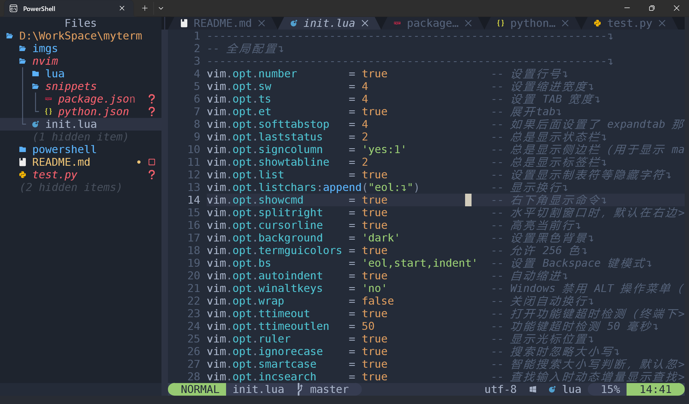
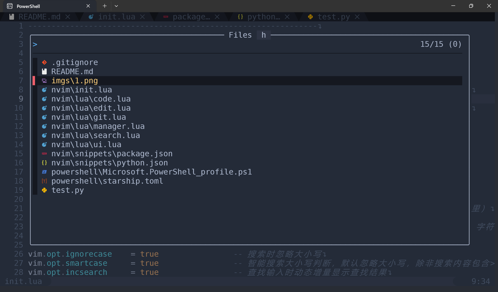
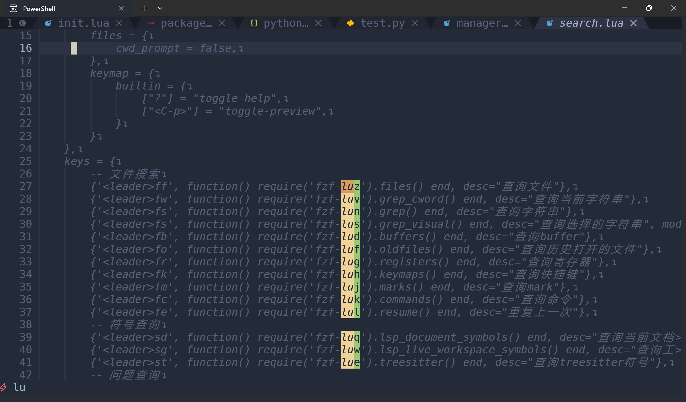
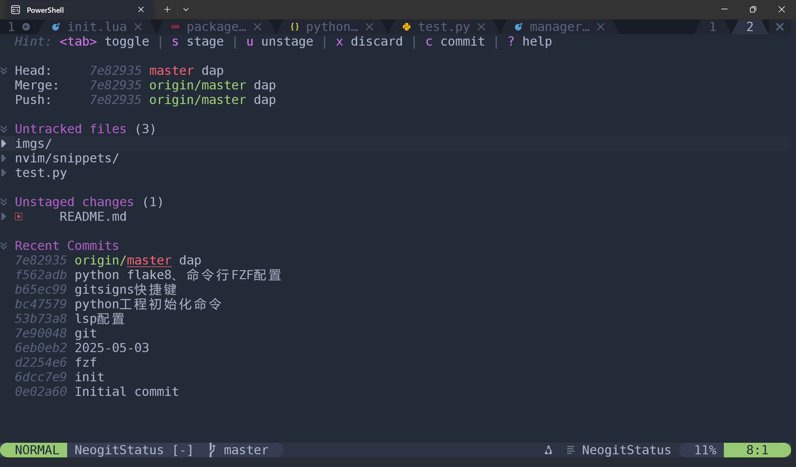
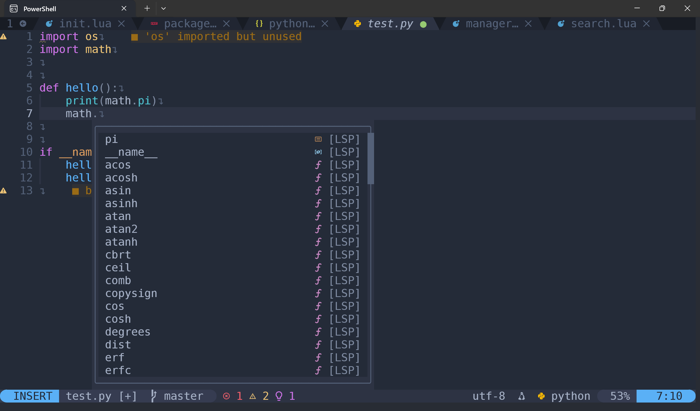

# myterm

## 介绍
俺滴终端

## 功能

#### Powershell

- WindowsTerminal
- Nerdfont
- rg: 字符串搜索
- fd: 文件搜索
- fzf: 交互式搜索
- yazi: 终端文件管理

#### Neovim:

- 侧边文件树
- 自定义状态栏
- Buffer页签
- 命令框UI、搜索框UI
- FZF搜索：字符串、文件、LSP相关、Buffer、Mark等
- 快速跳转
- LSP补全：Python
- Lint: flake8
- 自定义代码段
- Git：代码改动标识、Git管理界面

#### 安装教程

见

#### 使用说明

见

